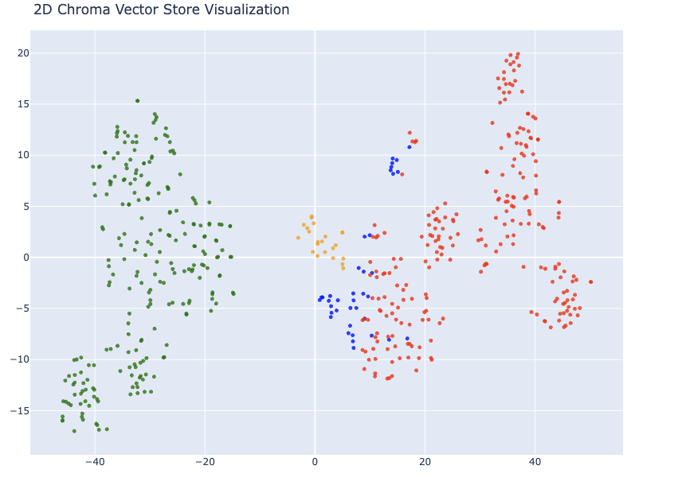
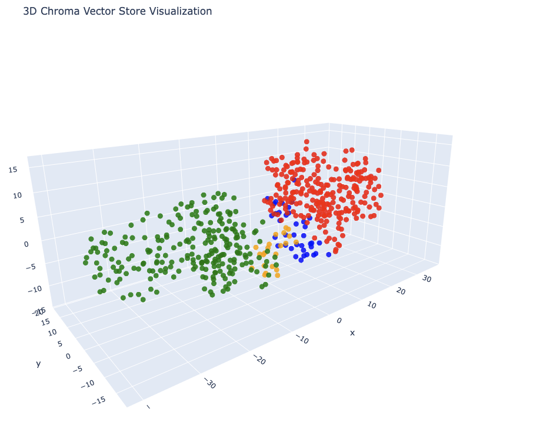
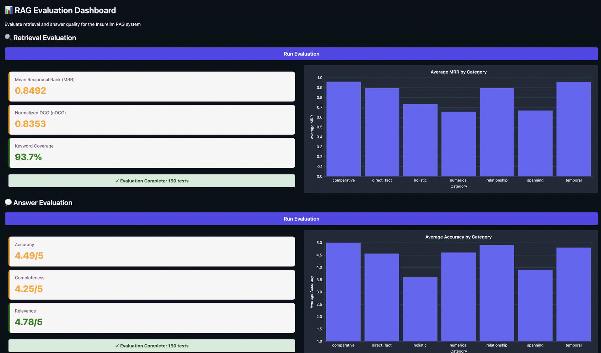

# LLM with RAG Example

Exercise from the LLM Engineering week 5 / day 3 project [here](https://github.com/ed-donner/llm_engineering/tree/main/week5/implementation).

## Run Vector DB migration

Ingest the data and create a new local vector database. Only needs to be run once (unless you change the model).

```bash
uv run ingest.py
```

## Run visualization

Check the the data on a 2D and 3D plot!

```bash
uv run visualize.py
```

## Run Evaluation App

Evaluate the RAG system.

```bash
uv run evaluator.py
```

## Run End User App

Manual testing.

```bash
uv run main.py
```

See [here](evaluation/tests.jsonl) for some example questions to ask!

# Results

The images below are screen captures. Run this on your computer to get an interactive version to experiment with!

## 2D Visualization



## 3D Visualization



## Evaluation



## Conclusion

Evaluation shows faily good results.

### Hierarchical RAG Evaluation

The is a separate branch that experimaents with Hierarchical RAG [here](https://github.com/reanblock/llm-rag-example/tree/introduce-hierarchical-rag).