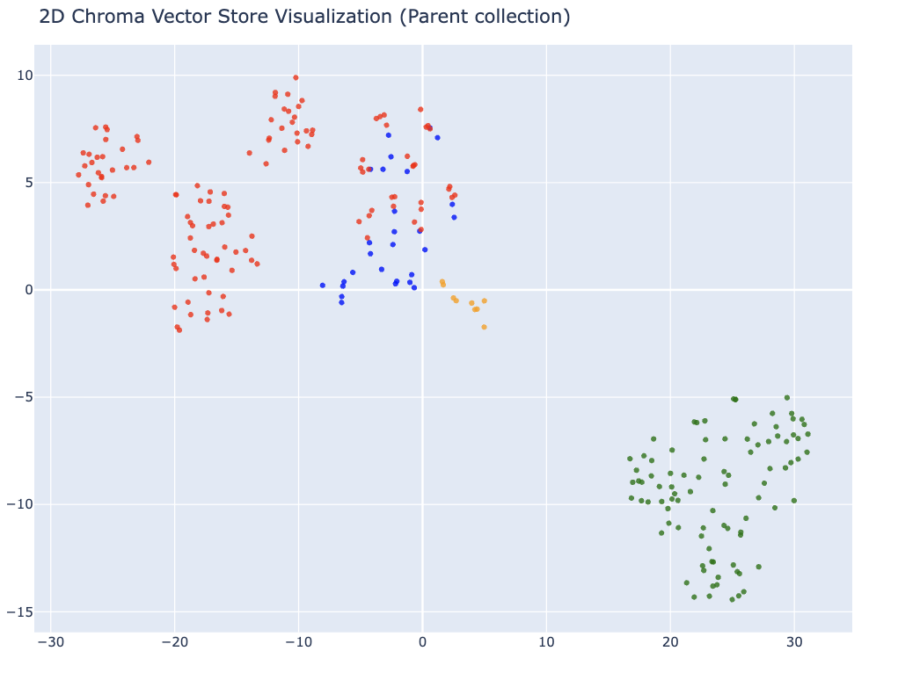
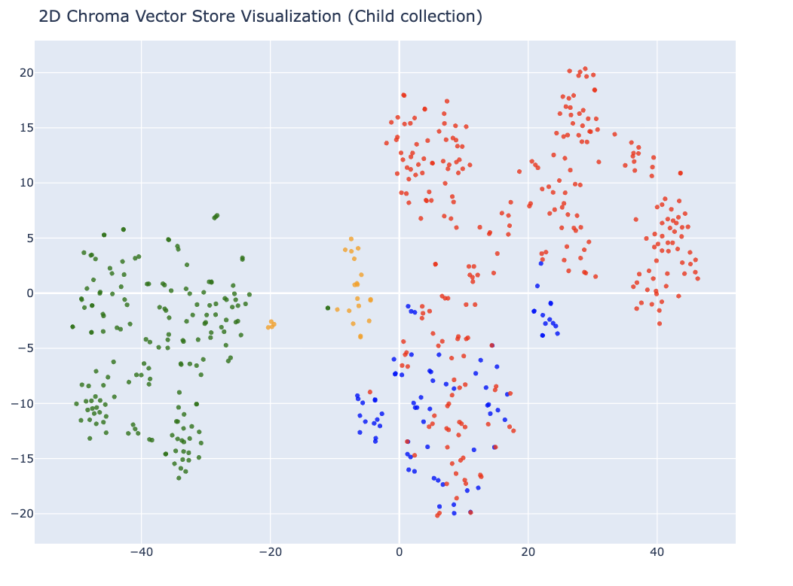
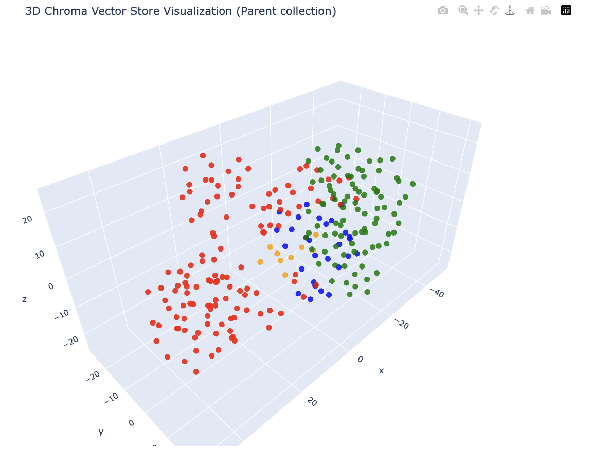
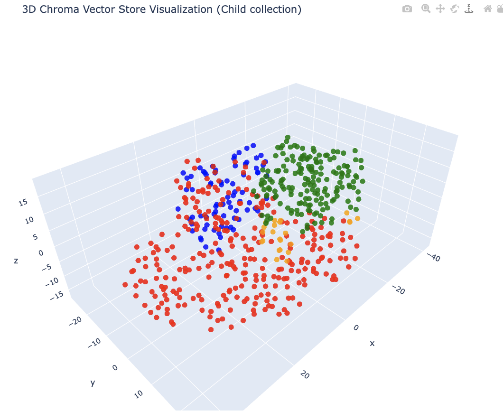
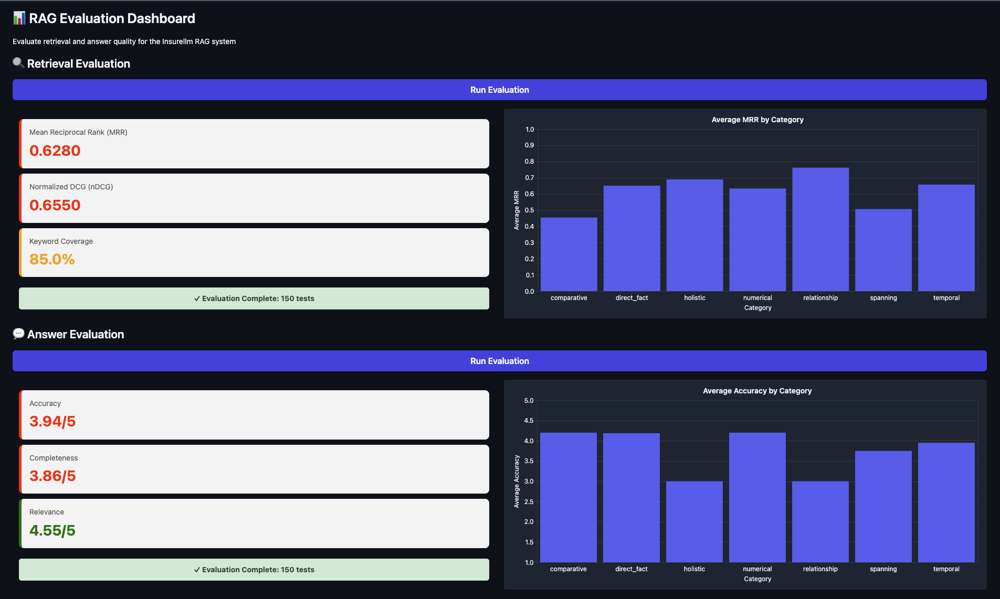

# LLM with RAG Example

Exercise from the LLM Engineering week 5 / day 3 project [here](https://github.com/ed-donner/llm_engineering/tree/main/week5/implementation).

## RAG Architecture

The techniques applied in this solution are:

1. Hierarchical RAG (small-to-big) — child chunks for precise retrieval, parent chunks for rich context
2. Query rewriting — LLM rephrases the question before retrieval for better KB matching
3. Dual retrieval — both the original and rewritten questions are queried against the vector store independently
4. Result merging & deduplication — the two result sets are combined and deduplicated by parent_id
5. LLM reranking — the merged parent chunks are reordered by relevance before being passed to the LLM
6. RAG answer generation — top 10 reranked parent chunks used as context for the final answer

## Run Vector DB migration

Ingest the data and create a new local vector database. Only needs to be run once (unless you change the model).

```bash
uv run ingest.py
```

## Run visualization

Check the the data on a 2D and 3D plot!

```bash
uv run visualize.py
```

## Run Evaluation App

Evaluate the RAG system.

```bash
uv run evaluator.py
```

## Run End User App

Manual testing.

```bash
uv run main.py
```

See [here](evaluation/tests.jsonl) for some example questions to ask!

# Results

The images below are screen captures. Run this on your computer to get an interactive version to experiment with!

## 2D Visualization

### Parent Embeddings



### Child Embeddings



## 3D Visualization

### Parent Embeddings



### Child Embeddings



## Evaluation

### Non Hierarchical RAG Version Evaluation


### Hierarchical RAG Version Evaluation




## Conclusion

Using Hierarchical RAG approach for this particular dataset is not recommended since it degrades the search quality.

The likely reason for this is that fewer unique parent chunks are returned (up to 20 children map to fewer parents due to deduplication), so the ranking pool is smaller and some relevant content that was retrievable via flat chunks is now being missed because:

1. The parent chunking by the LLM may have grouped content differently than expected
2. Child chunks that previously ranked highly are now being collapsed into the same parent, reducing diversity in the top results

The core problem is that this knowledge base is already fairly short, focused documents. Hierarchical RAG tends to shine when documents are long and dense
(think 20-page PDFs, legal contracts, technical manuals) where small flat chunks genuinely lose surrounding context. For the Insurellm knowledge base, which
is mostly short markdown files, the flat chunks were already capturing enough context and the hierarchy is adding overhead without adding any benefit.